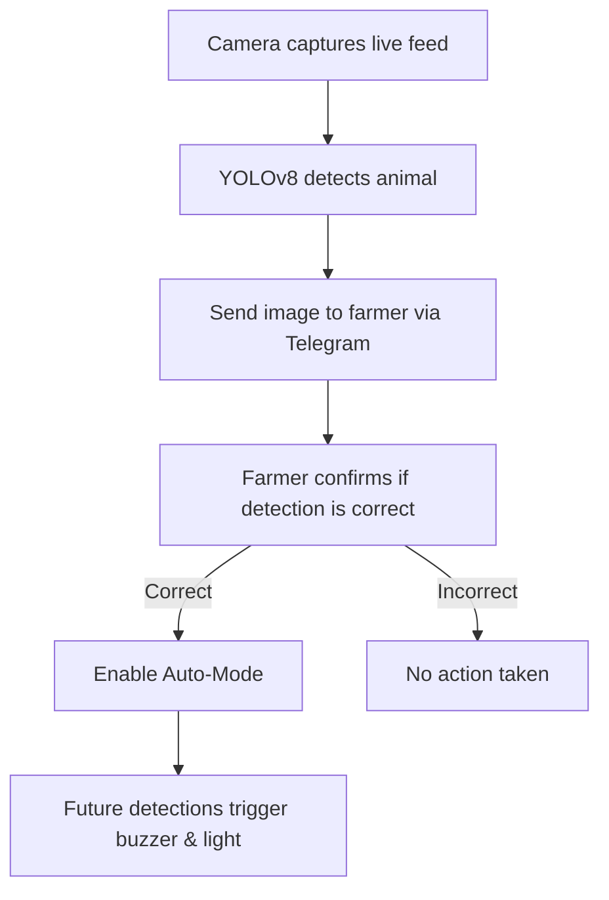

# 🐾 WildDetect-AIoT  
### **Smart AI + IoT Animal Detection System for Farmers**

Welcome to **WildDetect-AIoT** – a Raspberry Pi-powered AI bot that detects wild animals using **YOLOv8**, alerts the farmer via **Telegram**, and scares them off with a **buzzer + light combo**!  
Control everything from an **admin panel** and go fully **auto-mode** after confirming detections.  
**Peace of mind for your crops, powered by AI.**

---

## ✨ Features

| Feature           | Description                                                |
|------------------|------------------------------------------------------------|
| 🧠 **YOLOv8 Detection** | Real-time animal detection using camera feed and YOLOv8   |
| 📲 **Telegram Bot**     | Instant alerts and image notifications via Telegram       |
| 🛠️ **Admin Panel**      | Sign up, sign in, and control devices remotely            |
| 🔔 **Buzzer & Light**   | Scare off animals with GPIO-controlled hardware           |
| ✅ **Manual Review**     | Farmer confirms detection accuracy                        |
| 🤖 **Auto Mode**        | Automatically triggers hardware for future detections     |

---

## ⚙️ Hardware Requirements

- Raspberry Pi (with GPIO support) — tested on Raspberry Pi 5 & 4  
- Camera module (Pi Cam)  
- Buzzer module  
- Light module (LED or spotlight)  
- Internet connection (for Telegram bot communication)  

---

## 💻 Software Requirements

- Python 3.7+  
- [YOLOv8 (Ultralytics)](https://github.com/ultralytics/ultralytics)  
- Telethon  
- OpenCV  
- Pic2cam  
- PyTorch  

### **Install all required Python packages:**
```bash
pip install -r req.txt
```

---

## 🚀 Getting Started

### 1. Clone the Repo:
```bash
git clone https://github.com/NiloofarAbed/WildDetect-AIoT.git
cd WildDetect-AIoT
```

### 2. Create a Telegram Bot:
- Chat with [@BotFather](https://t.me/BotFather)  
- Save your **Bot Token**  
- Get your **API ID** and **API Hash** from [my.telegram.org](https://my.telegram.org)  

### 3. Update `bot.py`:
- Fill in your Bot Token, API ID, API Hash, and user settings  

### 4. Run the Bot:
```bash
python bot.py
```

---

## 🧪 How It Works



---

## 🛡 Admin Panel Features

From the web admin panel, you can:
- ✅ **Sign In / Sign Up**  
- 💡 **Toggle Light**  
- 🔔 **Toggle Buzzer**  
- 📸 **View Detected Images**  
- ⚙️ **View Account Information**

---

## 📁 Project Structure

```
WildDetect-AIoT/
├── bot/                        # Telegram bot and admin logic
│   ├── bot.py                  # Main Telegram bot logic
│   ├── data.py                 # Chart generation and DB processing
│   ├── req.txt                 # Python dependencies
│   ├── data/                   # Local database & historical data
│
├── camera/                     # Camera + YOLO module
│   ├── camera.py               # Image capture and YOLO processing
│   ├── epoch200                # YOLOv8 trained model weights
│
├── ngl/                        # Relay system: sends captured images to bot
```

---

## 🖼️ Screenshots

### **System Workflow**


### **Bot Screen**


### **Admin Panel**


---

## 📝 License & Citation

This project is licensed under the **MIT License**.

> **BUT** — if you use, modify, or build on this project in academic, research, or commercial work,  
> **you must cite the following publication:**

**Citation DOI:** [https://doi.org/10.1016/j.atech.2025.100829](https://doi.org/10.1016/j.atech.2025.100829)

> Give credit where it’s due — it supports the devs and helps the community thrive!